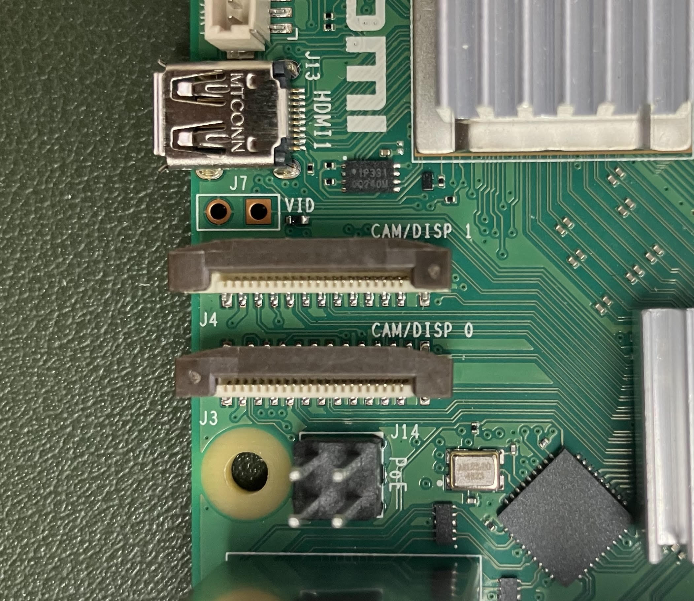

This README is for the [osmiaCAM build instructions](https://github.com/Crall-Lab/osmiaCAM/blob/main/README.md#osmiacam) and [GreenHouse Osmia Block](https://github.com/Crall-Lab/osmiaCAM/blob/main/README.md#greenhouse-osmia-block) build instructions.

## Table of contents

- [GreenHouse Osmia Block](#greenhouse-osmia-block)
  - [Install Raspberry Pi software](#install-raspberry-pi-software-1)
  - [Change device ID](#change-device-id-1)
  - [Pi Connect](#pi-connect-1)
  - [Connecting cameras](#connecting-cameras-1)
  - [Check mounting location of external hard drive](#check-mounting-location-of-external-hard-drive-1)
  - [Preview camera (to test focus, framing, etc)](#preview-camera-to-test-focus-framing-etc-1)
  - [Take a single full resolution photo](#take-a-single-full-resolution-photo-1)
  - [Clone this repository](#clone-this-repository-1)
  - [Make mount directory](#make-mount-directory-1)
  - [Install openCV library](#install-opencv-library-2)
  - [Add lines to the crontab](#add-lines-to-the-crontab-1)
  - [Testing](#testing-1)
  - [Deployment](#deployment-1)
  - [Check videos](#check-videos-1)
  - [Install openCV library](#install-opencv-library-3)


# GreenHouse Osmia Block 
## Install Raspberry Pi software
Format SD card using [Raspberry Pi Imager](https://www.raspberrypi.com/software/)

This guide uses a raspberry pi 5, and the 64-bit OS.

## Change device ID
Go to Raspberry Pi Configuration and provide a unique username when prompted. *NB user names should be labeled in a repeatable way (e.g., 'osmia1', 'osmia2') to easily associated with physical units. The user name will be saved in output files.

## Pi Connect
Click this:

Input the hostname of the pi as the name of your device when prompted.

Choose 'Turn On Raspberry Pi Connect'. The browser will open. Sign in, using the username of the pi as the device name.

You will now be able to connect to the raspberry pi here: [https://connect.raspberrypi.com/devices](https://connect.raspberrypi.com/devices)

## Connecting cameras
The external camera should be camera 1. The position is indicated by CAM/DISP 1 on the board of the raspberry pi:


## Check mounting location of external hard drive
run the following in terminal:
```bash
sudo fdisk -l
```
This will list mounted drives, and look for /dev/sda1 in last line.
Hard drives must be mounted at sda1. Do not connect other hard drives to pi.

## Preview camera (to test focus, framing, etc)
```bash
rpicam-hello -t 0 --camera 0 #you should see nest block face
```

## Take a single full resolution photo
```bash
rpicam-jpeg -o test.jpeg --camera 0
```

## Clone this repository
```bash
git clone https://github.com/Magaiarsa/osmiaGH.git
```
Move all contents of this repositoty into home directory ('~'). You can do it in the GUI, or input this into the terminal:
```bash
cp -rf osmiaGH/* ~
```

## Make mount directory
```bash
sudo mkdir /mnt/osmiaGH
```
If folder exists, it will refuse to make the directory. Ignore it and move on.

## Install openCV library
```bash
cd ~
python3 -m venv osmia_2025
source osmia_2025/bin/activate
pip3 install opencv-contrib-python
```

Now it's good to reboot:
```bash
sudo reboot -h now
```

## Add lines to the crontab
Open up crontab with the following command:
```bash
crontab -e
```
Choose 1.

Then add the following lines to the bottom of the crontab file if they're not there already (to get permissions and mount directory for external hard drive)
```bash
@reboot sudo systemctl daemon-reload
@reboot sudo mount /dev/sda1 /mnt/osmiaGH -o umask=000
@reboot sudo chmod 777 /mnt/osmiaGH
*/10 * * * * /usr/bin/python greenHouse.py
```

After adding the lines, ctl+s will save. Then use ctl+x to leave.

*NB if you want to use the camera (e.g, for preview, check focus, or to troubleshoot record.py script), turn off autoamted recording by commenting out that last line

Restart computer after updating crontab. osmiaCAM should run automatically after this.
```bash
sudo reboot -h now
```

## Testing
Restart and come back after 2 hours to check if expected files are in expected locations on hard drive. OsmiaCam should be created, with nestCam and ExtCam within. Each day will have each own folder within that. osmiaCAM will create 9 min 45 s video every 10 min of outside, 10s video of nest every 3 minutes during the day and every hour at night.

## Deployment
While deploying, it is advisable to check the focus of the camera and adjust as needed, even if the unit has been built and tested in the lab. However, if the above steps have been executed successfully, the normal functioning of the unit will interfer with this. To avoid this, edit the crontab:
```bash
crontab -e
```
Now comment out the lines that refer to dayShift scripts. It should look like this:
```bash
@reboot sudo systemctl daemon-reload
@reboot sudo mount /dev/sda1 /mnt/osmiaGH -o umask=000
@reboot sudo chmod 777 /mnt/osmiaGH
#*/10 * * * * /usr/bin/python greenHouse.py
```

Remember to uncomment these lines before actually deploying the unit.


## Check videos
Videos are recorded as .h264s, which are great for file sizes but a bit cumbersome to convert and view. We have written some utility functions to help out with this. 
First, for the nest and outside videos, a single frame from each video is now output automatically to check framing, etc
Second, you can first convert 'raw' h264 videos to mp4 on the pi with the 'converth264.py' function, and then view them with the 'play_mp4.py' script. Here's an example:

## Install openCV library
First if you haven't already, create a virtual environment and install openCV

```bash
cd ~
python3 -m venv osmia_2025
source osmia_2025/bin/activate
pip3 install opencv-contrib-python
```

Then run this in terminal:
```bash
cd ~
source osmia_2025/bin/activate
python3 converth264.py
```
This will prompt you for a filename. The easiest way to get this when communicating over Raspberry Pi Connect is by navigating to the h264 file you'd like to view, selecting 'copy path' under 'Edit' in the file browser, then click 'copy from remote'. Then in the window prompt, click 'paste to remote' back in the Terminal window

After a few moments (maybe a couple minutes for full sized videos), there should now be an mp4 video with the same filename. To view this file, now run:

```bash
python3 play_mp4.py
```
This will again prompt you for a filename, which now you'll have to add as the 'mp4' file, as above
